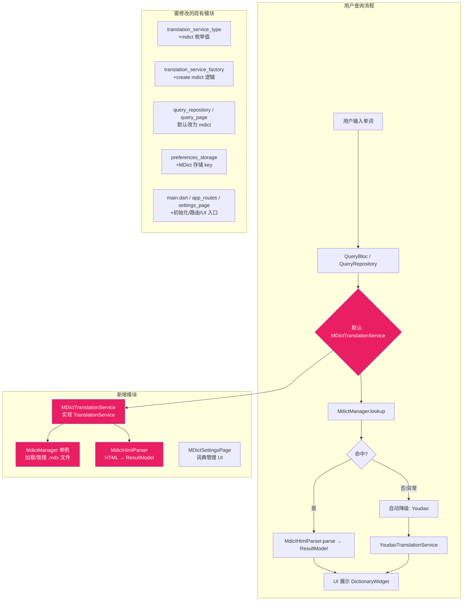

## Product Overview

将 Lando 翻译词典应用从默认使用有道在线翻译改为**默认使用 MDict 离线词典（ECDICT）**，在线翻译服务作为未命中时的自动降级备选。应用内打包 ECDICT 开源英汉词典（MIT 协议，76万+词条），同时支持用户导入自定义 .mdx 词典文件。

## Core Features

- **MDict 离线词典优先查询**：默认使用打包的 ECDICT 离线词典查词，无需网络
- **自动降级机制**：当离线词典未命中时，自动回退到 Youdao 在线翻译，用户无感知
- **多平台 Tab 展示**：DictionaryWidget 平台列表中 MDict 排首位，后续展示 Youdao/Bing/Apple 在线服务
- **词典管理页面**：新增设置入口，支持查看当前词典状态、启用/禁用离线词典、导入自定义词典文件
- **ECDICT 默认词典打包**：将 ECDICT（MIT 协议）的 .mdx 文件打包进 assets，首次启动时自动加载
- **兼容所有类型 MDict 词典**：HTML 解析器适配不同词典的 HTML 结构差异

## Tech Stack

- **框架**: Flutter + Dart (现有项目技术栈)
- **MDict 解析库**: `mdict_reader` (^0.0.3) — 支持 MDX/MDD 格式，API: `MdictReader().loadDictionary(path)` + `.lookup(word)` 返回 HTML 字符串
- **HTML 解析**: 自研 `MdictHtmlParser` — 使用正则表达式从 MDict 返回的 HTML 中提取结构化数据映射到 `ResultModel`
- **默认词典**: ECDICT (skywind3000/ECDICT, MIT License)，通过其 Python 工具链 `stardict.py export_mdx` 导出为 .mdx 文件

## Tech Architecture

### 整体架构（修改后）



### 核心设计决策

1. **MdictManager 单例模式** — 全局唯一实例，管理词典生命周期（加载/卸载/查询），与现有 `BingTokenService` 单例模式一致
2. **MDictTranslationService 实现 TranslationService 接口** — 无缝融入现有工厂模式和 DictionaryWidget 多平台架构，零侵入现有在线服务
3. **降级策略在 QueryRepository 层实现** — 当 MDict 返回空结果或抛异常时，QueryRepository 内部自动切换至 Youdao 完成查询，对上层 BLoC/Page 透明
4. **Assets → 临时目录加载策略** — 由于 dart:io 限制无法直接从 assets 读取 mdx，首次启动时将内置词典拷贝到 `ApplicationDocumentsDirectory` 后加载
5. **HTML 解析防御式设计** — MdictHtmlParser 对不同词典的 HTML 结构差异做兼容处理，缺失字段返回 null 而非崩溃

### 数据流

```
用户输入单词
  → QueryPage → QueryBloc(QueryRepository)
    → QueryRepository.lookupWithPronunciation()
      → [主路径] MDictTranslationService.translate() / getDetailedResult()
        → MdictManager().lookup(word) → 原始 HTML
        → MdictHtmlParser.parse(html) → ResultModel
      → [降级路径] 若 MDict 未命中 → YoudaoTranslationService 查询
    → 返回 {translation, detailedResult, pronunciationUrls}
    → QueryState 更新 → UI 渲染
```

## Implementation Details

### Directory Structure

```
lando/
├── assets/dictionaries/default/              # [NEW] 内置词典目录
│   └── ecdict.mdx                            #     ECDICT 词典文件 (~15-50MB)
├── lib/
│   ├── services/
│   │   ├── mdict/                            # [NEW] MDict 核心模块
│   │   │   ├── mdict_manager.dart            #     词典加载/管理单例
│   │   │   └── mdict_html_parser.dart        #     HTML→ResultModel 解析器
│   │   └── translation/
│   │       ├── translation_service.dart      # [MODIFY] 无改动（接口不变）
│   │       ├── translation_service_type.dart # [MODIFY] +mdict 枚举
│   │       ├── translation_service_factory.dart # [MODIFY] +mdict 分支
│   │       └── mdict_translation_service.dart # [NEW] 实现 TranslationService
│   ├── features/
│   │   ├── home/query/
│   │   │   ├── query_repository.dart         # [MODIFY] 默认改 mdict + 降级逻辑
│   │   │   └── query_page.dart               # [MODIFY] 默认平台 + 平台列表顺序
│   │   └── me/
│   │       ├── settings_page.dart             # [MODIFY] +离线词典入口 ListTile
│   │       ├── dictionary_settings_page.dart   # [MODIFY] 可能微调
│   │       └── mdict_settings_page.dart       # [NEW] 词典管理页面
│   ├── storage/
│   │   └── preferences_storage.dart           # [MODIFY] +MDict 相关 key/method
│   ├── routes/
│   │   └── app_routes.dart                    # [MODIFY] +mdictSettings 路由
│   ├── main.dart                              # [MODIFY] +启动时初始化 MDict
│   └── l10n/
│       ├── app_zh.arb                         # [MODIFY] +MDict i18n 字符串
│       ├── app_en.arb                         # [MODIFY] +MDict i18n 字符串
│       └── ... (其余5个arb文件同样修改)          # [MODIFY]
├── tools/
│   └── build_ecdict_mdx.sh                   # [NEW] ECDICT→MDX 构建脚本
└── pubspec.yaml                               # [MODIFY] +mdict_reader依赖 +assets
```

### 关键接口定义

**MdictManager** (`lib/services/mdict/mdict_manager.dart`):

```
class MdictManager {
  static final MdictManager instance = MdictManager._internal();
  factory MdictManager() => instance;
  MdictManager._internal();

  MdictReader? _reader;
  bool _isReady = false;
  
  Future<bool> initDefaultDictionary();  // 从 assets 拷贝并加载内置 ecdict.mdx
  Future<bool> loadCustomDictionary(String path);  // 加载自定义 .mdx
  Future<String?> lookup(String word);  // 查词返回原始 HTML
  bool get isReady => _reader != null && _isReady;
  String? get currentDictName;
  void dispose();  // 卸载词典释放资源
}
```

**MdictHtmlParser** (`lib/services/mdict/mdict_html_parser.dart`):

```
class MdictHtmlParser {
  static ResultModel parse({required String query, required String htmlContent});
  // 内部提取: simpleExplanation, translationsByPos, usPhonetic, ukPhonetic,
  //          examTypes, wordForm, phrases 等，映射到 ResultModel 各字段
}
```

**MDictTranslationService** (`lib/services/translation/mdict_translation_service.dart`):

```
class MdictTranslationService implements TranslationService {
  @override String get name => 'MDict';
  @override Future<String> translate(String query);
  @override Future<ResultModel?> getDetailedResult(String query);
}
```

## Implementation Notes

### 性能考虑

- **首次加载耗时**：ecdict.mdx 文件较大（~15-50MB），首次从 assets 拷贝到文档目录需要时间。应在 `_runAppInit()` 中用 `unawaited()` 异步执行，不阻塞 UI 启动；同时在 UI 上显示"词典加载中..."状态
- **内存占用**：MdictReader 加载索引后驻留内存。只保持一个词典实例，切换词典前先 dispose 当前实例
- **查询性能**：MDX 的索引查找是 O(log n)，性能良好

### 兼容性处理

- **Web 平台不支持**：mdict_reader 依赖 dart:io。Web 端应跳过 MDict 初始化，直接使用在线服务
- **降级逻辑边界**：MDict 未加载完成时（`!isReady`），QueryRepository 应直接走 Youdao 降级路径，而非报错
- **HTML 解析容错**：不同词典的 HTML 结构差异大，解析器应对每个字段做 try-catch 包裹，缺失字段优雅降级为 null

### Assets 加载流程

由于 Flutter assets 在 iOS/Android 上为只读压缩包资源，而 mdict_reader 需要随机文件访问：

1. 应用启动时检查 `documentsDirectory/ecdict.mdx` 是否存在
2. 若不存在，从 `assets/dictionaries/default/ecdict.mdx` 拷贝到文档目录
3. 使用文档目录中的文件路径调用 `MdictReader().loadDictionary(path)`

### 现有代码模式遵循

- 单例模式参照 `BingTokenService.instance`
- 存储操作参照 `PreferencesStorage` 的静态方法风格
- 工厂模式扩展现有 `TranslationServiceFactory.create()` switch
- 设置页 UI 风格参照 `ProxySettingsPage` 的 ListTile + SectionCard 结构
- 国际化参照现有 arb 文件的 `@description` 注释风格
- 路由注册参照 `AppRoutes` 的常量 + generateRoute 模式

## 设计概述

本次变更主要涉及**功能层和架构层改造**，不涉及大规模视觉重设计。需要新建的 UI 页面为 **MDictSettingsPage（离线词典管理页）**，以及在 SettingsPage 中添加一个入口 ListTile。

## 页面规划

### Page 1: SettingsPage（修改）— 新增入口

在现有的"词典"Section 区域中，在"词典设置"和"代理设置"之间新增一个"离线词典"ListTile，图标使用 book 图标，点击导航至 MDictSettingsPage。

### Page 2: MDictSettingsPage（新建）— 词典管理

包含以下功能块：

- **顶部区域**：标题栏 + 当前词典状态卡片（显示词典名称、词条数、加载状态）
- **开关区块**：启用/禁用离线词典 Switch
- **词典信息区块**：当前加载的词典名称、文件大小、最后更新时间
- **操作按钮区块**："导入词典"按钮（打开文件选择器导入自定义 .mdx）、"重置为默认词典"按钮
- **提示信息区**：说明文字（支持的格式、词典来源等）

整体设计风格与现有 ProxySettingsPage 保持一致的 Material 3 卡片式布局。

## Agent Extensions

### SubAgent: code-explorer

- **Purpose**: 在实施过程中深度探索项目中各文件的详细实现细节，确保新代码与现有模式完全一致
- **Expected outcome**: 准确定位每个需要修改的文件的具体行号和上下文模式，避免因理解偏差导致的返工